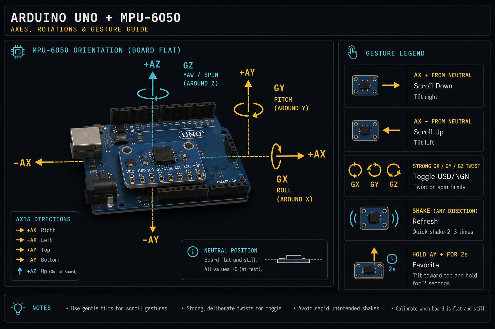

# EkstraDash

EkstraDash is a gesture-controlled crypto price dashboard powered by a physical Arduino and MPU-6050 sensor through the Ekstra motion network. It combines live crypto market data, a pinned Ekstra/XTRA Dexscreener row, Fear & Greed mood styling, local WebSocket controls, and an Ekstra prototype phone-IMU ingest path for hardware-originated motion samples.

## Wiring

| MPU-6050 | Arduino Uno |
| --- | --- |
| VCC | 5V |
| GND | GND |
| SCL | A5 |
| SDA | A4 |

## Arduino IDE Setup

Install the Arduino IDE, select **Arduino Uno** from **Tools > Board**, then choose your serial port from **Tools > Port**. Install the **Adafruit MPU6050**, **Adafruit Unified Sensor**, and **ArduinoJson** libraries from Library Manager before uploading your sketch.

The Arduino should emit JSON lines:

```json
{"ax":0,"ay":0,"az":0,"gx":0,"gy":0,"gz":0,"shake":false}
```

## Environment

Create `.env` from `.env.example`.

| Variable | Purpose |
| --- | --- |
| `SERIAL_PORT` | Hardware serial port, default `COM3`. |
| `BAUD_RATE` | Arduino serial speed, default `115200`. |
| `MOCK_SERIAL` | Use fake serial samples when `true`; read real Arduino USB serial when `false`. |
| `DEBUG_SERIAL` | Print every raw serial sample when `true`; keep `false` during normal use. |
| `DEBUG_GESTURES` | Print calibrated movement deltas such as `dx`, `dy`, `dz`, `gx`, `gy`, and `gz` for gesture tuning. |
| `WS_PORT` | Local WebSocket broadcast port, default `8080`. |
| `EKSTRA_PHONE_IMU_ENABLED` | Mirror Arduino samples to Ekstra's prototype phone IMU ingest path when `true`. |
| `EKSTRA_PHONE_IMU_INGEST_URL` | Phone IMU ingest endpoint, default `https://ekstra.ai/api/phone-imu/ingest`. |
| `EKSTRA_PHONE_IMU_HEALTH_URL` | Phone IMU health endpoint, default `https://ekstra.ai/api/phone-imu/health`. |
| `EKSTRA_CLOUD_WS_ENABLED` | Connect to Ekstra's hosted WebSocket and log `motion.samples` when `true`. |
| `EKSTRA_CLOUD_WS_URL` | Hosted Ekstra WebSocket endpoint, default `wss://ekstra.ai/ws`. |
| `EKSTRA_API_KEY` | Operator/runtime key used as `X-Operator-Key` for device registration and Motion Packet ingest. |

No secrets are committed. `bridge/keypair.json` is generated once and ignored.

## Find Your Serial Port

| System | How to find it |
| --- | --- |
| Windows | Open Device Manager, expand **Ports (COM & LPT)**, then use the shown `COM` value. |
| macOS | Run `ls /dev/cu.*` before and after plugging in the Arduino. |
| Linux | Run `ls /dev/ttyACM* /dev/ttyUSB*` before and after plugging in the Arduino. |

## Run Frontend

```bash
npm install
npm run dev
```

The Ekstra/XTRA row is pinned above Bitcoin using the Dexscreener pair configured in `src/config.js`.

## Run Bridge

```bash
cd bridge
npm install
node index.js
```

Expected logs:

```text
[serial] mock active
[ekstra] keypair loaded
[ws] listening on 8080
```

For real Arduino mode, set:

```env
MOCK_SERIAL=false
SERIAL_PORT=COM3
BAUD_RATE=115200
```

Then run `node index.js` again. A successful serial connection logs:

```text
[serial] connected COM3 @ 115200
```

## Gesture Map



The bridge calibrates the first few Arduino samples as the neutral resting pose. Keep the board still when starting `node index.js`, then point the board at the screen and move it away from neutral for gestures.

| Motion | Bridge gesture | Dashboard action |
| --- | --- | --- |
| Move the held board from top to bottom of the screen, `ax +` from neutral | `SCROLL_DOWN` | Select next coin |
| Move the held board from bottom to top of the screen, `ax -` from neutral | `SCROLL_UP` | Select previous coin |
| Move the held board sideways to the left, `ay -` from neutral | `REFRESH` | Refetch market prices |
| Move the held board sideways to the right, `ay +` from neutral | `TOGGLE_CURRENCY` | Switch USD and NGN |

## Keyboard Fallback

| Key | Action |
| --- | --- |
| ArrowUp | `SCROLL_UP` |
| ArrowDown | `SCROLL_DOWN` |
| R | `REFRESH` |
| C | `TOGGLE_CURRENCY` |
| F | `FAVORITE` |

## Ekstra Runtime Notes

The local dashboard is controlled through `ws://localhost:8080` so the demo stays responsive even when hosted Ekstra observer broadcast is unavailable or degraded.

For prototype Ekstra runtime testing, set `EKSTRA_PHONE_IMU_ENABLED=true`. The bridge maps Arduino MPU-6050 samples into Ekstra's documented phone IMU ingest shape and POSTs them to `/api/phone-imu/ingest`. A successful post logs:

```text
[ekstra] phone IMU ingest active
```

The bridge also generates an ed25519 keypair once and can sign canonical Motion Packets for `/api/v1/runtime/packets/ingest`, but that custom-device route requires the proper Ekstra operator/runtime credential in `EKSTRA_API_KEY`. Without it, the bridge still signs packets locally and skips posting them.

To confirm local dashboard control, look for:

```text
[gesture] SCROLL_DOWN ax=... ay=...
[ws] broadcast SCROLL_DOWN to 1 client(s)
```

For gesture tuning, set `DEBUG_GESTURES=true`, restart the bridge, and watch the `gesture-debug` lines while moving the board.
